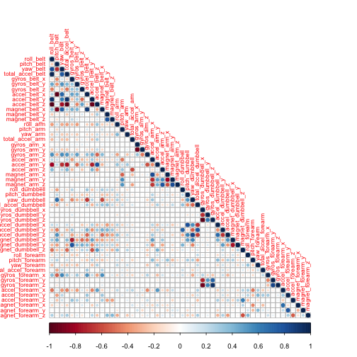
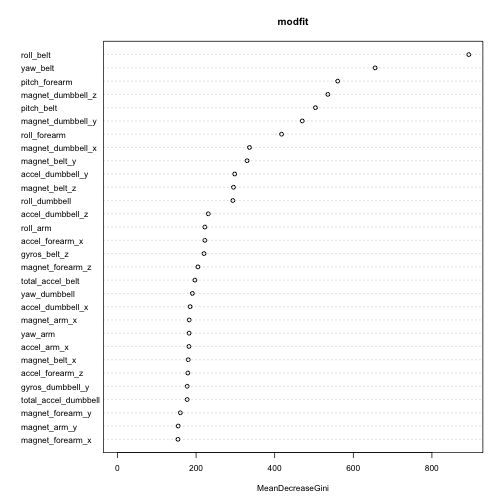

Practical Machine Learning Peer Review Assignment
========================================================
## Synopsis

In this project, people were asked to perform barbell lifts correctly and incorrectly in 5 different ways. Our goal is using data from accelerometers on the belt, forearm, arm, and dumbell of 6 participants to predict the category of movement that human text subjects intentionally exhibited when performing a simple physical exercise, based on sensor data. I will start from trimming the data sets, then establish and cross validate a predictive model from pml-train.csv using random forest algoritm, and use the model to predit the unlabeled data set pml-test.csv.

More information is available from the website here: http://groupware.les.inf.puc-rio.br/har  


## Download files

```r
if (!file.exists("./pml-training.csv")) {
    download.file("https://d396qusza40orc.cloudfront.net/predmachlearn/pml-training.csv", 
              "pml-training.csv", method = "curl")
}

if (!file.exists("./pml-testing.csv")) {
download.file("https://d396qusza40orc.cloudfront.net/predmachlearn/pml-testing.csv", 
              "pml-testing.csv", method = "curl")
}
```

## Read training and testing csv files

```r
rawtraining <- read.csv("pml-training.csv", na.strings = c("NA", ""))
rawtesting <- read.csv("pml-testing.csv", na.strings = c("NA", ""))
```
check the size of data

```r
dim(rawtraining); dim(rawtesting)
```

```
## [1] 19622   160
```

```
## [1]  20 160
```

```r
m <- ncol(rawtraining)
```

## Trimming the data to prevent overfitting

There are 160 variables in boths data sets. However, not all of them are useful. 

### Remove the unuseful columns (personal information, time stamps, etc.) and empty columns

```r
rmcols1 <- grep("timestamp|X|user_name|new_window|num_window",names(rawtraining))
train1 <- rawtraining[, -rmcols1]
rmcols2 <- grep("timestamp|X|user_name|new_window|num_window",names(rawtesting))
test1 <- rawtesting[, -rmcols2] ## remove unuseful

rmnacols1 <- colSums(is.na(train1))
train2 <- train1[, rmnacols1 == 0]
rmnacols2 <- colSums(is.na(test1))
test2 <- test1[, rmnacols2 ==0] ## remove NAs
```

### Remove the highly correlated variable pairs

```r
library(caret)
```

```
## Loading required package: lattice
## Loading required package: ggplot2
```

```r
library(corrplot)

corMatrix <- cor(train2[, -ncol(train2)])
corrplot(corMatrix, method = "circle", type = "lower", tl.cex = 0.7)
```

 

```r
highCorr <- findCorrelation(corMatrix, cutoff = 0.99)    ## high correlation cutoff = 0.9
train3 <- cbind(train2[, -highCorr])    
test3 <- test2[, -highCorr]  ## remove highly correlated pairs
n <- ncol(train3)
rm(rawtraining); rm(rawtesting);rm(train1); rm(train2); rm(test1); rm(test2) ## release memory
```
From the correlation figure, most of the predictors do not exhibit high correlation. Nonetheless, there are still a few variables that are highly correlated with another. They are removed for preventin overfitting.

Now the train data set has 52 variables left (including classe).

## Establish and validate predictive model

In this report, random forest algorithm was used for prediction.

### split train data into training and testing

```r
set.seed(12345)
inTrain <- createDataPartition(train3$classe, p = 0.7, list = F)
training <- train3[inTrain, ]
testing <- train3[-inTrain, ]
```

### predictive model: random forest

```r
library(randomForest)
```

```
## randomForest 4.6-7
## Type rfNews() to see new features/changes/bug fixes.
```

```r
set.seed(67890)
modfit <<- randomForest(classe ~ ., data = training)
varImpPlot(modfit, cex = .7)
```

 

```r
modfit
```

```
## 
## Call:
##  randomForest(formula = classe ~ ., data = training) 
##                Type of random forest: classification
##                      Number of trees: 500
## No. of variables tried at each split: 7
## 
##         OOB estimate of  error rate: 0.52%
## Confusion matrix:
##      A    B    C    D    E class.error
## A 3904    1    0    0    1    0.000512
## B   15 2638    5    0    0    0.007524
## C    0   17 2374    5    0    0.009182
## D    0    0   19 2232    1    0.008881
## E    0    0    1    7 2517    0.003168
```
The confusion matrix output shows how well the model predicted/classified the values in the training set.

### Cross validation testing and out-of-sample error estimate

```r
crosstest <- predict(modfit, testing)
confusionMatrix(testing$classe, crosstest)$table
```

```
##           Reference
## Prediction    A    B    C    D    E
##          A 1673    1    0    0    0
##          B   10 1126    3    0    0
##          C    0   10 1014    2    0
##          D    0    0   14  950    0
##          E    0    0    0    5 1077
```

```r
accuracy <- postResample(testing$classe, crosstest)
accuracy 
```

```
## Accuracy    Kappa 
##   0.9924   0.9903
```
The confusion matrix output shows how well the model predicted/classified the values in the cross validation data set.


## Saving answers for auto grader

```r
answers <- predict(modfit, test3)
pml_write_files = function(x){
    n = length(x)
    for(i in 1:n){
        filename = paste0("problem_id_",i,".txt")
        write.table(x[i],file=filename,quote=FALSE,row.names=FALSE,col.names=FALSE)
    }
}
pml_write_files(answers)
```
The answer saved achieved the 100% accuracy by auto grader.

